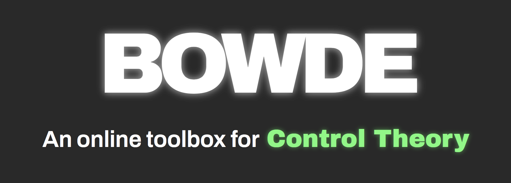

# BOWDE

BOWDE is an online toolbox for Control Theory in the style of Desmos.

## With Bowde, you can:
* Graph Bode & Time Response & Nyquist diagrams
* Overlay Multiple graphs at once
* Simple and easy Math equation input UI
* Provide informations about Stability,Precision & Speed of your system

Like Desmos, BOWDE offers a simple and intuitive slider UI to quickly visualize the impact of variables on your system.

Tutorials and explanations about the code can be found here: https://www.notion.so/BOWDE-Documentation-b3e1f56ec4a64214b891c339e3c44173

